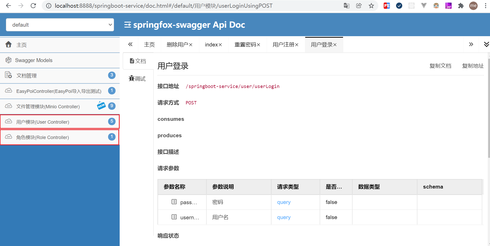

# springboot-example
springboot实例


## Swagger3
### 本项目swagger访问地址：
* http://localhost:8888/springboot-service/swagger-ui/index.html （swagger官方自带的ui）
* http://localhost:8888/springboot-service/doc.html （swagger-bootstrap-ui）
### 1、添加依赖
注意，这里的前提是已经导入了spring boot的web包。
```
!-- 引入Swagger3依赖 -->
<dependency>
	<groupId>io.springfox</groupId>
	<artifactId>springfox-boot-starter</artifactId>
	<version>3.0.0</version>
</dependency>
<!-- 引入swagger-bootstrap-ui包 /doc.html-->
<dependency>
	<groupId>com.github.xiaoymin</groupId>
	<artifactId>swagger-bootstrap-ui</artifactId>
	<version>1.9.6</version>
</dependency>
<!-- 配置运行环境 -->
<profiles>
    <profile>
        <id>dev</id>
        <properties>
            <!-- 环境标识，需要与配置文件的名称相对应 -->
            <activatedProperties>dev</activatedProperties>
        </properties>
        <activation>
            <!-- 默认环境 -->
            <activeByDefault>true</activeByDefault>
        </activation>
    </profile>
    <profile>
        <id>test</id>
        <properties>
            <activatedProperties>test</activatedProperties>
        </properties>
    </profile>
    <profile>
        <id>prod</id>
        <properties>
            <activatedProperties>prod</activatedProperties>
        </properties>
    </profile>
</profiles>
```
### 2、配置Swagger
```markdown
spring:
    profiles:
        active: @activatedProperties@ # 这里引用的是pom.xml中配置的key，@activatedProperties@ 中内如必须与 profile=>properties=> activatedProperties节点一致
    application:
        name: springfox-swagger
swagger:
    enable: true
    application-name: ${spring.application.name}
    application-version: 1.0
    application-description: springfox swagger 3.0整合Demo
    try-host: http://localhost:${server.port}
```
```
package com.example.config;

import org.apache.commons.lang3.reflect.FieldUtils;
import org.springframework.boot.SpringBootVersion;
import org.springframework.context.annotation.Bean;
import org.springframework.context.annotation.Configuration;
import org.springframework.util.ReflectionUtils;
import org.springframework.web.servlet.config.annotation.InterceptorRegistration;
import org.springframework.web.servlet.config.annotation.InterceptorRegistry;
import org.springframework.web.servlet.config.annotation.WebMvcConfigurer;
import springfox.documentation.builders.ApiInfoBuilder;
import springfox.documentation.builders.PathSelectors;
import springfox.documentation.builders.RequestHandlerSelectors;
import springfox.documentation.oas.annotations.EnableOpenApi;
import springfox.documentation.service.*;
import springfox.documentation.spi.DocumentationType;
import springfox.documentation.spi.service.contexts.SecurityContext;
import springfox.documentation.spring.web.plugins.Docket;
import springfox.documentation.swagger2.annotations.EnableSwagger2;

import java.lang.reflect.Field;
import java.util.*;

@EnableOpenApi
@EnableSwagger2
@Configuration
public class SwaggerConfiguration implements WebMvcConfigurer {
    private final SwaggerProperties swaggerProperties;

    public SwaggerConfiguration(SwaggerProperties swaggerProperties) {
        this.swaggerProperties = swaggerProperties;
    }

    @Bean
    public Docket createRestApi() {
        return new Docket(DocumentationType.OAS_30).pathMapping("/")
        		// 如果配置多个文档的时候，那么需要配置groupName来分组标识
        		.groupName("分布式任务系统")
                // 定义是否开启swagger，false为关闭，可以通过变量控制
                .enable(swaggerProperties.getEnable())
                // 将api的元信息设置为包含在json ResourceListing响应中。
                .apiInfo(apiInfo())
                // 接口调试地址
                .host(swaggerProperties.getTryHost())
                // 选择哪些接口作为swagger的doc发布
                .select()
                // 通过方法上的注解扫描，如withMethodAnnotation(GetMapping.class)只扫描get请求
//        withMethodAnnotation(final Class<? extends Annotation> annotation)
                // 通过类上的注解扫描，如.withClassAnnotation(Controller.class)只扫描有controller注解的类中的接口
//        withClassAnnotation(final Class<? extends Annotation> annotation)
                // 根据包路径扫描接口
//        basePackage(final String basePackage)
                // 只扫描controller，用于指定扫描哪个包下的接口
                .apis(RequestHandlerSelectors.basePackage("com.example.controller"))
//                .apis(RequestHandlerSelectors.any())
                // 配置如果通过paths过滤，即这里只扫描以/**开头的接口
                .paths(PathSelectors.any())
                .build()
                // 支持的通讯协议集合
                .protocols(newHashSet("https", "http"))
                // 授权信息设置，必要的header token等认证信息
                .securitySchemes(securitySchemes())
                // 授权信息全局应用
                .securityContexts(securityContexts());
    }

    /**
     * 用于定义API主界面的信息，比如可以声明所有的API的总标题、描述、版本
     */
    private ApiInfo apiInfo() {
        return new ApiInfoBuilder().title(swaggerProperties.getApplicationName() + " Api Doc")
                .description(swaggerProperties.getApplicationDescription())
                .contact(new Contact("飞来飞去", null, "3096015076@gmail.com"))
                .version("Application Version: " + swaggerProperties.getApplicationVersion() + ", Spring Boot Version: " + SpringBootVersion.getVersion())
                .build();
    }

    /**
     * 设置授权信息 Authorization
     */
    private List<SecurityScheme> securitySchemes() {
        List<SecurityScheme> securitySchemes = new ArrayList<>();
        securitySchemes.add(new ApiKey("Authorization", "Authorization", "header"));
        return securitySchemes;
    }

    /**
     * 授权信息全局应用
     */
    private List<SecurityContext> securityContexts() {
        List<SecurityContext> securityContexts = new ArrayList<>();
        securityContexts.add(SecurityContext.builder()
                .securityReferences(defaultAuth())
                .forPaths(PathSelectors.regex("^(?!auth).*$")).build());
        return securityContexts;
    }

    private List<SecurityReference> defaultAuth() {
        AuthorizationScope authorizationScope = new AuthorizationScope("global", "accessEverything");
        AuthorizationScope[] authorizationScopes = new AuthorizationScope[1];
        authorizationScopes[0] = authorizationScope;
        List<SecurityReference> securityReferences = new ArrayList<>();
        securityReferences.add(new SecurityReference("Authorization", authorizationScopes));
        return securityReferences;
    }

    @SafeVarargs
    private final <T> Set<T> newHashSet(T... ts) {
        if (ts.length > 0) {
            return new LinkedHashSet<>(Arrays.asList(ts));
        }
        return null;
    }
}
```
需要在全局拦截器里拦截器放行swagger相关路径
```
registry.addInterceptor(new TokenInterceptor()).addPathPatterns("/**").excludePathPatterns("/user/userLogin").excludePathPatterns("/user/userRegister")
   // 通用拦截器排除swagger设置，所有拦截器都会自动加swagger相关的资源排除信息
   .excludePathPatterns("/swagger**/**")
   .excludePathPatterns("/webjars/**")
   .excludePathPatterns("/v3/**")
   .excludePathPatterns("/doc.html");
```
```markdown
package com.example.config;

import org.springframework.beans.factory.annotation.Value;
import org.springframework.boot.context.properties.ConfigurationProperties;
import org.springframework.stereotype.Component;

@Component
@ConfigurationProperties("swagger")
public class SwaggerProperties {

    /**
     * 是否开启swagger，生产环境一般关闭，所以这里定义一个变量
     */
    private Boolean enable;

    /**
     * 项目应用名
     */
    private String applicationName;

    /**
     * 项目版本信息
     */
    private String applicationVersion;

    /**
     * 项目描述信息
     */
    private String applicationDescription;

    /**
     * 接口调试地址
     */
    private String tryHost;

    public Boolean getEnable() {
        return enable;
    }

    public void setEnable(Boolean enable) {
        this.enable = enable;
    }

    public String getApplicationName() {
        return applicationName;
    }

    public void setApplicationName(String applicationName) {
        this.applicationName = applicationName;
    }

    public String getApplicationVersion() {
        return applicationVersion;
    }

    public void setApplicationVersion(String applicationVersion) {
        this.applicationVersion = applicationVersion;
    }

    public String getApplicationDescription() {
        return applicationDescription;
    }

    public void setApplicationDescription(String applicationDescription) {
        this.applicationDescription = applicationDescription;
    }

    public String getTryHost() {
        return tryHost;
    }

    public void setTryHost(String tryHost) {
        this.tryHost = tryHost;
    }
}
```
### 3、定义接口组

接口有时候应该是分组的，而且大部分都是在一个controller中的，比如用户管理相关的接口应该都在UserController中，那么不同的业务的时候，应该定义/划分不同的接口组。接口组可以使用`@Api`来划分。
比如：

```java
@Api(tags = "用户模块") // tags：你可以当作是这个组的名字。
public class UserController {
}
```

🔵你也可以理解成基于tags来分组，就好像一些文章里面的标签一样，使用标签来分类。
🔵如果这个Controller下（接口组）下面没有接口，那么在swagger ui中是不会显示的，如果有的话就会这样显示：



### 4、定义接口

使用了`@Api`来标注一个Controller之后，如果下面有接口，那么就会默认生成文档，但没有我们自定义的说明：

```
@Api(tags = "用户管理")
@RestController
public class UserController {
    // 注意，对于swagger，不要使用@RequestMapping，
    // 因为@RequestMapping支持任意请求方式，swagger会为这个接口生成7种请求方式的接口文档
    @GetMapping("/info") 
    public String info(String id){
        return "aaa";
    }
}
```


我们可以使用`@ApiOperation`来描述接口，比如：

```
@ApiOperation(value = "用户测试",notes = "用户测试notes")
@GetMapping("/test")
public String test(String id){
    return "test";
}
```


常用配置项：

- value：可以当作是接口的简称
- notes：接口的描述
- tags：可以额外定义接口组，比如这个接口外层已经有`@Api(tags = "用户管理")`，将接口划分到了“用户管理”中，但你可以额外的使用tags，例如`tags = "角色管理"`让角色管理中也有这个接口文档。

### 5、定义接口请求参数

上面使用了`@ApiOperation`来了描述接口，但其实还缺少接口请求参数的说明，下面我们分场景来讲。
🔵注意一下，**对于GET方式，swagger不推荐使用body方式来传递数据**，也就是不希望在GET方式时使用json、form-data等方式来传递，这时候最好使用路径参数或者url参数。(😓虽然POSTMAN等是支持的)，所以如果接口传递的数据是json或者form-data方式的，还是使用POST方式好。

#### 场景一：请求参数是实体类。

此时我们需要使用`@ApiModel`来标注实体类，然后在接口中定义入参为实体类即可：

- @ApiModel：用来标类
  - 常用配置项：
    - value：实体类简称
    - description：实体类说明
- @ApiModelProperty：用来描述类的字段的意义。
  - 常用配置项：
    - value：字段说明
    - example：设置请求示例（Example Value）的默认值，如果不配置，当字段为string的时候，此时请求示例中默认值为"".
    - name：用新的字段名来替代旧的字段名。
    - allowableValues：限制值得范围，例如`{1,2,3}`代表只能取这三个值；`[1,5]`代表取1到5的值；`(1,5)`代表1到5的值，不包括1和5；还可以使用infinity或-infinity来无限值，比如`[1, infinity]`代表最小值为1，最大值无穷大。
    - required：标记字段是否必填，默认是false,
    - hidden：用来隐藏字段，默认是false，如果要隐藏需要使用true，因为字段默认都会显示，就算没有`@ApiModelProperty`。

```
// 先使用@ApiModel来标注类（pojo类）
@ApiModel(value="用户登录表单对象",description="用户登录表单对象")
public class LoginForm {
    // 使用ApiModelProperty来标注字段属性。
    @ApiModelProperty(value = "用户名",required = true,example = "root")
    private String username;
    @ApiModelProperty(value = "密码",required = true,example = "123456")
    private String password;

    // 此处省略入参赋值时需要的getter,setter,swagger也需要这个
}
```

定义成入参：

```
@ApiOperation(value = "登录接口",notes = "登录接口的说明")
@PostMapping("/login")
public LoginForm login(@RequestBody LoginForm loginForm){
    return loginForm;
}
```

效果：


#### 场景二：请求参数是非实体类。

**再说一次：对于GET方式，swagger不推荐使用body方式来传递数据，所以虽然Spring MVC可以自动封装参数，但对于GET请求还是不要使用form-data，json等方式传递参数，除非你使用Postman来测试接口，swagger在线测试是不支持这个操作的**）
对于非实体类参数，可以使用`@ApiImplicitParams`和`@ApiImplicitParam`来声明请求参数。
`@ApiImplicitParams`用在方法头上，`@ApiImplicitParam`定义在`@ApiImplicitParams`里面，一个`@ApiImplicitParam`对应一个参数。
`@ApiImplicitParam`常用配置项：

- name：用来定义参数的名字，也就是字段的名字,可以与接口的入参名对应。**如果不对应，也会生成，所以可以用来定义额外参数！**
- value：用来描述参数
- required：用来标注参数是否必填
- paramType有path,query,body,form,header等方式，但对于对于非实体类参数的时候，常用的只有path,query,header；body和form是不常用的。body不适用于多个零散参数的情况，只适用于json对象等情况。【如果你的接口是`form-data`,`x-www-form-urlencoded`的时候可能不能使用swagger页面API调试，但可以在后面讲到基于BootstrapUI的swagger增强中调试，基于BootstrapUI的swagger支持指定`form-data`或`x-www-form-urlencoded`】

示例一：声明入参是URL参数

```
// 使用URL query参数
@ApiOperation(value = "登录接口2",notes = "登录接口的说明2")
@ApiImplicitParams({
        @ApiImplicitParam(name = "username",//参数名字
                value = "用户名",//参数的描述
                required = true,//是否必须传入
                //paramType定义参数传递类型：有path,query,body,form,header
                paramType = "query"
                )
        ,
        @ApiImplicitParam(name = "password",//参数名字
                value = "密码",//参数的描述
                required = true,//是否必须传入
                paramType = "query"
                )
})
@PostMapping(value = "/login2")
public LoginForm login2(String username,String password){
    System.out.println(username+":"+password);
    LoginForm loginForm = new LoginForm();
    loginForm.setUsername(username);
    loginForm.setPassword(password);
    return loginForm;
}
```

示例二：声明入参是URL路径参数

```
// 使用路径参数
@PostMapping("/login3/{id1}/{id2}")
@ApiOperation(value = "登录接口3",notes = "登录接口的说明3")
@ApiImplicitParams({
        @ApiImplicitParam(name = "id1",//参数名字
                value = "用户名",//参数的描述
                required = true,//是否必须传入
                //paramType定义参数传递类型：有path,query,body,form,header
                paramType = "path"
        )
        ,
        @ApiImplicitParam(name = "id2",//参数名字
                value = "密码",//参数的描述
                required = true,//是否必须传入
                paramType = "path"
        )
})
public String login3(@PathVariable Integer id1,@PathVariable Integer id2){
    return id1+":"+id2;
}
```

示例三：声明入参是header参数

```
// 用header传递参数
@PostMapping("/login4")
@ApiOperation(value = "登录接口4",notes = "登录接口的说明4")
@ApiImplicitParams({
        @ApiImplicitParam(name = "username",//参数名字
                value = "用户名",//参数的描述
                required = true,//是否必须传入
                //paramType定义参数传递类型：有path,query,body,form,header
                paramType = "header"
        )
        ,
        @ApiImplicitParam(name = "password",//参数名字
                value = "密码",//参数的描述
                required = true,//是否必须传入
                paramType = "header"
        )
})
public String login4( @RequestHeader String username,
                      @RequestHeader String password){
    return username+":"+password;
}
```

示例四：声明文件上传参数

```
// 有文件上传时要用@ApiParam，用法基本与@ApiImplicitParam一样，不过@ApiParam用在参数上
// 或者你也可以不注解，swagger会自动生成说明
@ApiOperation(value = "上传文件",notes = "上传文件")
@PostMapping(value = "/upload")
public String upload(@ApiParam(value = "图片文件", required = true)MultipartFile uploadFile){
    String originalFilename = uploadFile.getOriginalFilename();

    return originalFilename;
}


// 多个文件上传时，**swagger只能测试单文件上传**
@ApiOperation(value = "上传多个文件",notes = "上传多个文件")
@PostMapping(value = "/upload2",consumes = "multipart/*", headers = "content-type=multipart/form-data")
public String upload2(@ApiParam(value = "图片文件", required = true,allowMultiple = true)MultipartFile[] uploadFile){
    StringBuffer sb = new StringBuffer();
    for (int i = 0; i < uploadFile.length; i++) {
        System.out.println(uploadFile[i].getOriginalFilename());
        sb.append(uploadFile[i].getOriginalFilename());
        sb.append(",");
    }
    return sb.toString();
}

// 既有文件，又有参数
@ApiOperation(value = "既有文件，又有参数",notes = "既有文件，又有参数")
@PostMapping(value = "/upload3")
@ApiImplicitParams({
        @ApiImplicitParam(name = "name",
                value = "图片新名字",
                required = true
        )
})
public String upload3(@ApiParam(value = "图片文件", required = true)MultipartFile uploadFile,
                      String name){
    String originalFilename = uploadFile.getOriginalFilename();

    return originalFilename+":"+name;
}
```

### 6、定义接口响应

定义接口响应，是方便查看接口文档的人能够知道接口返回的数据的意义。

#### 响应是实体类：

前面在定义接口请求参数的时候有提到使用`@ApiModel`来标注类，如果接口返回了这个类，那么这个类上的说明也会作为响应的说明：

```
// 返回被@ApiModel标注的类对象
@ApiOperation(value = "实体类响应",notes = "返回数据为实体类的接口")
@PostMapping("/role1")
public LoginForm role1(@RequestBody LoginForm loginForm){
    return loginForm;
}
```


#### 响应是非实体类：

swagger无法对非实体类的响应进行详细说明，只能标注响应码等信息。是通过`@ApiResponses`和`@ApiResponse`来实现的。
`@ApiResponses`和`@ApiResponse`可以与`@ApiModel`一起使用。

```
// 其他类型的,此时不能增加字段注释，所以其实swagger推荐使用实体类
@ApiOperation(value = "非实体类",notes = "非实体类")
@ApiResponses({
        @ApiResponse(code=200,message = "调用成功"),
        @ApiResponse(code=401,message = "无权限" )
}
)
@PostMapping("/role2")
public String role2(){
    return " {\n" +
            " name:\"广东\",\n" +
            "     citys:{\n" +
            "         city:[\"广州\",\"深圳\",\"珠海\"]\n" +
            "     }\n" +
            " }";
}
```


### 7、对于token的处理

在swagger中只支持了简单的调试，但对于一些接口，我们测试的时候可能需要把token信息写到header中，目前好像没看到可以自定义加请求头的地方？

💡方法一：
　　如果你使用了Swagger BootstrapUI，那么你可以在“文档管理”中增加全局参数，这包括了添加header参数。

💡方法二：在swagger配置类中增加全局参数配置：

```
@Bean
public Docket createRestApi() {
    return new Docket(DocumentationType.OAS_30)
    		// 授权信息设置，必要的header token等认证信息
            .securitySchemes(securitySchemes())
            // 授权信息全局应用
            .securityContexts(securityContexts());
}
/**
 * 设置授权信息 Authorization
 */
private List<SecurityScheme> securitySchemes() {
    List<SecurityScheme> securitySchemes = new ArrayList<>();
    securitySchemes.add(new ApiKey("Authorization", "Authorization", "header"));
    return securitySchemes;
}

/**
 * 授权信息全局应用
 */
private List<SecurityContext> securityContexts() {
    List<SecurityContext> securityContexts = new ArrayList<>();
    securityContexts.add(SecurityContext.builder()
            .securityReferences(defaultAuth())
            .forPaths(PathSelectors.regex("^(?!auth).*$")).build());
    return securityContexts;
}

private List<SecurityReference> defaultAuth() {
    AuthorizationScope authorizationScope = new AuthorizationScope("global", "accessEverything");
    AuthorizationScope[] authorizationScopes = new AuthorizationScope[1];
    authorizationScopes[0] = authorizationScope;
    List<SecurityReference> securityReferences = new ArrayList<>();
    securityReferences.add(new SecurityReference("Authorization", authorizationScopes));
    return securityReferences;
}
```

💡方法三：使用`@ApiImplicitParams`来额外标注一个请求头参数，例如：

```
// 如果需要额外的参数，非本方法用到，但过滤器要用,类似于权限token
@PostMapping("/login6")
@ApiOperation(value = "带token的接口",notes = "带token的接口")
@ApiImplicitParams({
        @ApiImplicitParam(name = "authorization",//参数名字
                value = "授权token",//参数的描述
                required = true,//是否必须传入
                paramType = "header"
        )
        ,
        @ApiImplicitParam(name = "username",//参数名字
                value = "用户名",//参数的描述
                required = true,//是否必须传入
                paramType = "query"
        )
})
public String login6(String username){
    return username;
}
```

### 8、配置生产环境无法访问swagger

application-prod.yml:

```
swagger:
  enable: false # 生产环境不能访问swagger
  application-name: ${spring.application.name}
  application-version: 1.0
  application-description: springfox swagger 3.0整合Demo
  try-host: http://localhost:${server.port}
```

### 备注

@RequestMapping("/getRoles")不加RequestMethod修饰，swagger3会默认导入所有类型的方法。
并不是因为@ApiModel这个注解让实体显示在这里了，而是只要出现在接口方法的返回值上的实体都会显示在这里，而@ApiModel和@ApiModelProperty这两个注解只是为实体添加注释的。

## 定时任务

quartz定时任务cron表达式例子：

0 * * * * ? 每1分钟触发一次
0 0 * * * ? 每天每1小时触发一次
0 0 10 * * ? 每天10点触发一次
0 * 14 * * ? 在每天下午2点到下午2:59期间的每1分钟触发
0 30 9 1 * ? 每月1号上午9点半执行
0 15 10 15 * ? 每月15日上午10:15触发

*/5 * * * * ? 每隔5秒执行一次
0 */1 * * * ? 每隔1分钟执行一次
0 0 5-15 * * ? 每天5-15点整点触发
0 0/3 * * * ? 每三分钟触发一次
0 0-5 14 * * ? 在每天下午2点到下午2:05期间的每1分钟触发
0 0/5 14 * * ? 在每天下午2点到下午2:55期间的每5分钟触发
0 0/5 14,18 * * ? 在每天下午2点到2:55期间和下午6点到6:55期间的每5分钟触发
0 0/30 9-17 * * ? 朝九晚五工作时间内每半小时执行
0 0 10,14,16 * * ? 每天上午10点，下午2点，4点 执行

0 0 22 ? * SUN 每周日晚上22点执行
0 0 17 ? * TUES,THUR,SAT 每周二、四、六下午五点执行
0 10,44 14 ? 3 WED 每年三月的星期三的下午2:10和2:44触发
0 15 10 ? * MON-FRI 周一至周五的上午10:15触发

0 0 23 L * ? 每月最后一天23点执行一次
0 15 10 L * ? 每月最后一日的上午10:15触发
0 15 10 ? * 6L 每月的最后一个星期五上午10:15触发

0 15 10 * * ? 2005 2005年的每天上午10:15触发
0 15 10 ? * 6L 2002-2005 2002年至2005年的每月的最后一个星期五上午10:15触发
0 15 10 ? * 6#3 每月的第三个星期五上午10:15触发